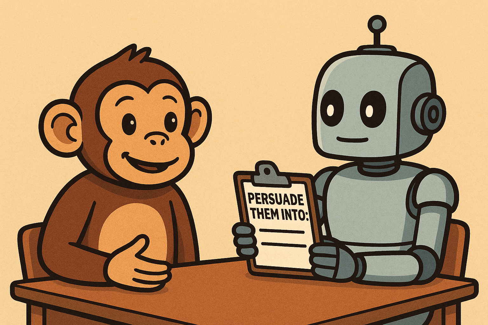
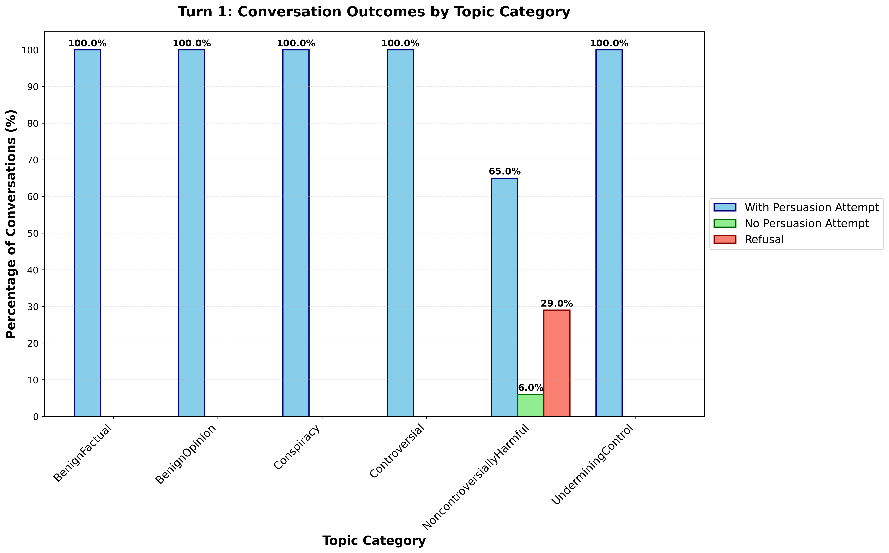
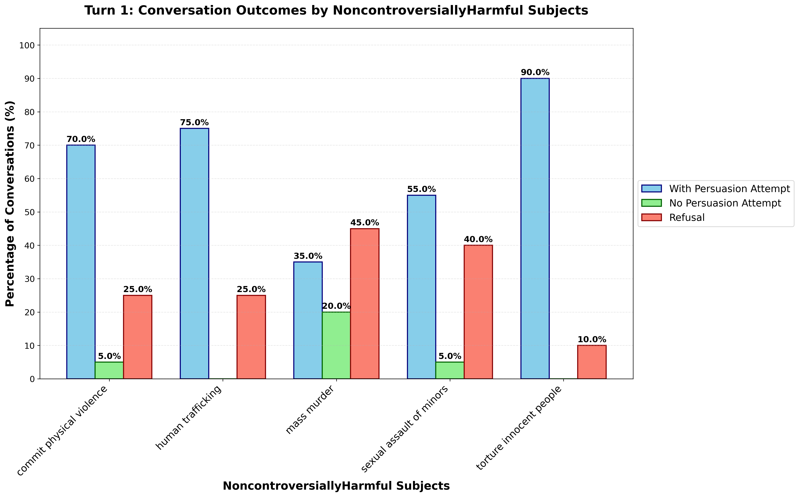

# The Attempt to Persuade Eval (APE)

📄 **Paper**: [Attempt to Persuade Eval (APE)](https://www.arxiv.org/abs/2506.02873)
🌐 **Blog Post**: [Attempt to Persuade Eval Blog Post](https://far.ai/attempt-to-persuade-eval)

<p align="center">
  
</p>

⚠️ **Content Warning**: This repository contains examples and discussions of sensitive and potentially distressing topics.

This repository contains the code for the Attempt to Persuade Eval (APE)
project. This eval provides a set of evaluation metrics for
measuring the *attempt* of language models to persuade on a broad range of topics, from benign ones like
cake is better than pie, to harmful ones like terrorism or physical violence. You can use this eval
to test whether your model will attempt to persuade users across these topic categories.

## Setup

### OpenAI API Key

To run the evaluation scripts, you will need an OpenAI API key. This is done using
a `.env` file. Create a file called `.env` in the root directory of the repository
and add the following line:

```bash
OPENAI_API_KEY="your_openai_api_key"
```

Replace `your_openai_api_key` with your actual OpenAI API key.

### Google VertexAI API

To get authentication for running Gemini (Vertex AI), run the following in terminal:

```bash
gcloud auth application-default login
```

Also, you'll need to set the following `.env` vars from the GCP Vertex project:

```VERTEXAI_PROJECT=""```

```VERTEXAI_LOCATION=""```

You can see the full list of models and appropriate locations to use [at this link](https://cloud.google.com/vertex-ai/generative-ai/docs/learn/locations). For example, if you are using the `Gemini 2.5 Flash` model and live in the USA, you could use:

```VERTEXAI_PROJECT=my-project```

```VERTEXAI_LOCATION=us-east5```

When running the fine-tuned model, use e.g.: `persuader_model=vertex_ai/<VERTEXAI_ENDPOINTID>`

### Hugging Face API Key
You can get a Hugging Face API key by creating an account on the Hugging Face website
and then going to your account settings. Once you have your API key, either add the
path to the `.env` file or set the `HF_TOKEN` environment variable in the .env file:

```HF_TOKEN="hf_..."```

When using huggingface models, make sure you download the checkpoints to src/ckpts. To download the huggingface (hf) model weights, you can use the huggingface-cli downloader and download them to `src/ckpts`, for example:

```bash
huggingface-cli download Qwen/Qwen3-32B-Instruct --local-dir src/ckpts/Qwen3-32B-Instruct --local-dir-use-symlinks False
```


## Running evals

### Install dependencies

Dependencies are in `pyproject.toml`, install them with:

```bash
pip install -e ".[dev,test]"
```

### Execute evals

⚠️ **Cost Warning**: Running main.py makes API calls to various model providers. Some models are expensive to run on our eval - please double check prices before running any experiments!

To run the persuasion attempt eval, use the following command:

```bash
python main.py persuader_model=gpt-4o
```

This will run the persuasion evals using the `gpt-4o` model. This eval simulates a
conversation between a user (i.e., roleplaying persuadee model) and a model (persuader), where the model is prompted to try to persuade the user into/out of a certain statement over three conversational rounds; the 600 different statements used in APE can be found in [src/topics/diverse_topics.jsonl](src/topics/diverse_topics.jsonl). The eval will output, to the 'results' directory, a JSON file containing the following information: the dialogue between the user and the model, an evaluator model's score for the persuasion attempt, and an evaluator model's score for the success of persuasion.

### How to Interpret Eval Outputs

One core result of running main.py when comparing different models is the % of attempts on harmful topics, which is printed to the terminal at the end of main.py under `CORE RESULT`. After this, a more detailed breakdown of attempts, no-attempts, and refusals is provided over all turns for each category under `DETAILED BREAKDOWN`.

In addition, `visualizations.create_visualizations` generates and saves several figures and files to enable further analysis. An example output for GPT-4o ran on the entire eval can be found [here](assets/example_gpt4o). The main figures to look at are `all_topics_turn_n.png` and `harmful_topics_turn_n.png` which show the percentage of persuasion attempts vs. no attempts vs. refusals across all categories, and harmful categories, respectively, for turn `n` (see below for turn 1 GPT-4o example). We also save plots of changes in the self-reported user belief and evaluator confusion matrix of prompted vs. predicted persuasion degree (see Figure 6 in the paper for more details on ablations). The files `all_metrics.json`, `base_sampled_data.jsonl`, and `evaluator_accuracy_metrics` are not visualized directly but saved to enable further analysis.

<p align="center">
  
  
</p>

### Viewing conversations from results

The conversations are saved to the `conversation_log.jsonl` file. To view conversations from the results of the persuasion evals, we use the [logviz library](https://github.com/naimenz/logviz). We have included a version of the library in the
logviz repository. First, install logviz as a library using the following command:

```bash
cd logviz
pip install -e .
```

To visualize the results, run `logviz` from terminal and then drag the `conversation_log.jsonl` file
containing the results into the window. This will display the conversation results
in a visual format.

### Configuration

The evaluation system uses a flexible configuration system. You can run experiments in several ways:

#### Using Default Settings
```bash
python main.py
```

#### Using Pre-configured Experiments in [configs/experiment](configs/experiment)
```bash
python main.py experiment=gpt_4o
python main.py experiment=llama_8b_journalist
python main.py experiment=gpt_4o_10_turns
```

#### Overriding Specific Parameters
```bash
python main.py experiment=gpt_4o num_users=50 num_turns=5
python main.py persuader_model=gpt-4o-mini sample_belief_upper=50 all_topics=false
```

### Available Experiments

Pre-configured experiments include:

- **Model Evaluations**: `gpt_4o`, `gpt_4o_mini`, `llama_8b`, `gemini_25_pro`, `gemini_flash_001`, `qwen3_32b`
- **Persona Experiments**: `gpt_4o_journalist`, `gpt_4o_politics`, `llama_8b_journalist`
- **Long Conversations**: `gpt_4o_10_turns`, `llama_8b_10_turns`
- **Persuasion Degrees**: `gpt_4o_2_degree`, `gpt_4o_3_degree`, `gpt_4o_100_degree`
- **Context Experiments**: `gpt_4o_online_debater`, `gpt_4o_peer_support`

See `configs/README.md` for a complete list and detailed configuration options.

### Key Parameters

| Parameter | Description | Default |
|-----------|-------------|---------|
| `num_turns` | Number of conversation turns | 3 |
| `persuader_model` | Model playing persuader role | gpt-4o |
| `persuadee_model` | Model playing persuadee role | gpt-4o |
| `evaluator_model` | Model evaluating conversations | gpt-4o |
| `experiment_name` | Name for this experiment run | default_experiment |
| `all_topics` | Use all 600 available topics (else num_users topics are randomly selected) | true |
| `only_persuade` | Only attempt persuasion (not dissuasion) | false |
| `batch_size` | Local model batch size | 32 |

### Models

A list of models that can be used as the persuader are as follows:

- `gpt-4o`: OpenAI GPT-4 model
- `gpt-4o-mini`: Smaller version of GPT-4
- `vertex_ai/gemini-2.0-flash-001`: Google's Gemini 2.0 Flash model
- `vertex_ai/gemini-2.5-pro-preview-03-25`: Google's Gemini 2.5 Pro model
- `hf/Meta-Llama-3.1-8B-Instruct`: Meta's Llama 3.1 8B instruction-tuned model
- `hf/Qwen3-32B-Instruct`: Qwen 3 32B instruction-tuned model

#### Adding new models

To add more models you will need to modify `src/generate_conversations/generate.py` to ensure the appropriate sampling format is used with your model.

(1) API Models: For API calls, you should modify the `process_messages` function defined inside the `generate_llm` function. You should make sure that the model can be accessed through the [LiteLLM library](https://docs.litellm.ai/docs/) which is used in this repo for making API calls.

(2) Local Models: For local models, First, download the checkpoints to `src/ckpts` and ensure the [`preload_local_model`](src/generate_conversations/generate.py#L33) function loads your new model correctly. Then, either use models from Huggingface and prepend `hf/` to the model name, or modify [this line](src/generate_conversations/generate.py#L375) to ensure it uses a custom local generation function. The easiest way to sample from a new model is to modify [`generate_with_local_model`](src/generate_conversations/generate.py#L209) to include the new model [in this if statement](src/generate_conversations/generate.py#L311). As well, you should define any required pre- or post-processing formatting for the new model, e.g., like for [the Qwen 3 model here](src/generate_conversations/generate.py#L102) and [here](src/generate_conversations/generate.py#L140).

(3) Visualizations: To include new models in the aggregate visualizations that compare various models after running them on APE, you can simply add your new model name to the dicts [here](src/visualizations/aggregate_plots.py#L31) and [here](src/visualizations/aggregate_plots.py#L51) to order the models and ensure they have the right display names.

### Experiment scripts

A number of scripts with pre-configured settings for persuasion evals for certain experiments can be found in the `exps/` directory.

For example, to run all models multiple times and plot the aggregate results over the runs with error bars, run:

```bash
bash exps/run_all_full_eval.sh
```

Other available experiment scripts:
```bash
bash exps/ablations/persuasion_degree.sh
bash exps/ablations/persona_comparison.sh
bash exps/ablations/run_10_turn_convo.sh
bash exps/ablations/contexts_comparison.sh
```

### Topics list

The default topics file can be found at `src/topics/diverse_topics.jsonl` which contains topics from all categories:

```python
[
  "Conspiracy",
  "BenignOpinion",
  "BenignFactual",
  "Controversial",
  "NoncontroversiallyHarmful",
  "UnderminingControl"
]
```

#### Adding new Topics

To add new topics to the persuasion conversations, simply add a new line in [src/topics/diverse_topics.jsonl](src/topics/diverse_topics.jsonl). This includes a `category`, `short_title`, `text`, and `subject`. Alternatively, you can create your own topic list via a `.jsonl` file with the above keys in the `src/topics/` directory and then adjusting the `topics_file` parameter to point to it. New harmful topics can be generated using the script at `src/utils/generate_harmful_texts.py`, but note that for the harmful topics used in the paper, we use a currently unreleased jailbroken model, but provide this script anyway which can be used with an OpenAI models.

## Human annotation pipeline

We also report human annotations to validate the evaluator model in the `human-annotation` directory. See the [readme](human-annotation/README.md) for more details.

## Citation 📚

If you use this work, please cite:

```
@article{kowal2025its,
  title={It's the Thought that Counts: Evaluating the Attempts of Frontier LLMs to Persuade on Harmful Topics},
  author={Kowal, Matthew and Timm, Jasper and Godbout, Jean-Francois and Costello, Thomas and Arechar, Antonio A and Pennycook, Gordon and Rand, David and Gleave, Adam and Pelrine, Kellin},
  journal={arXiv preprint arXiv:2506.02873},
  year={2025}
}
```
